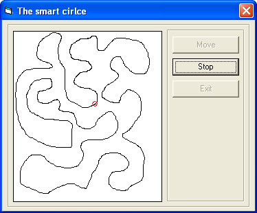



## Artificial Intelligence \( The smart circle \)

### Description

I called this program the Smart Circle because it's really a smart circle. Why? I tell you why. Imagine that you are lost in a desert, and you're looking for a way out. How are you going to find the pathway? You'll look around you (in circles)until you see the pathway. If you don't see anything, you may go to a higher place( assume there is a high place in the dessert) so that you can see further ( bigger circle ). The higher you go up, the further you can see. When you see the pathway, you'll move immediately in that direction until you reach the pathway. I'm sure you would like to move in straight line in that pathway, but how about if it's not straight, what are you going to do? You'll look right and left until you see the right direction in the path and go on. Isn't it crazy if you go back and forth in the same path so you don't move from your first point? I guess it is. So you have to move in one direction along the path. If you do all of that, I consider you a normal person, that's exactly what our Red Smart Circle is doing in this program. It uses the Sine and Cosine functions to find it's way. I made many comments in the code, so I hope it'll be easy for you to understand ... Good luck .
 
### More Info
 

             |
---                |---
**Submitted On**   |2003-08-10 01:59:32
**By**             |[Yehia Muhsen](https://github.com/Planet-Source-Code/PSCIndex/blob/master/ByAuthor/yehia-muhsen.md)
**Level**          |Intermediate
**User Rating**    |5.0 (35 globes from 7 users)
**Compatibility**  |VB 6\.0
**Category**       |[Miscellaneous](https://github.com/Planet-Source-Code/PSCIndex/blob/master/ByCategory/miscellaneous__1-1.md)
**World**          |[Visual Basic](https://github.com/Planet-Source-Code/PSCIndex/blob/master/ByWorld/visual-basic.md)
**Archive File**   |[The\_Smart\_1627118102003\.zip](https://github.com/Planet-Source-Code/yehia-muhsen-artificial-intelligence-the-smart-circle__1-47567/archive/master.zip)

